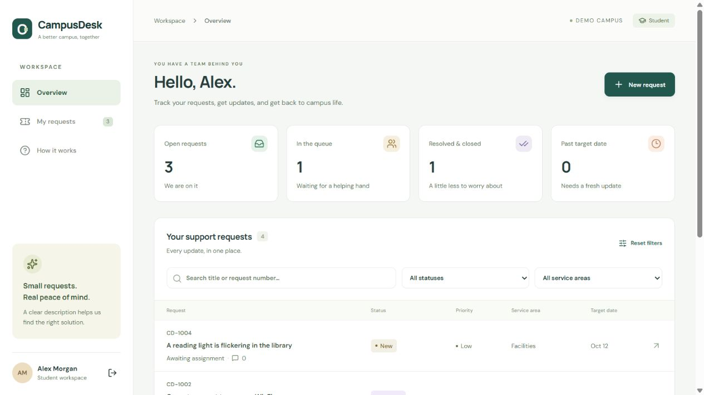
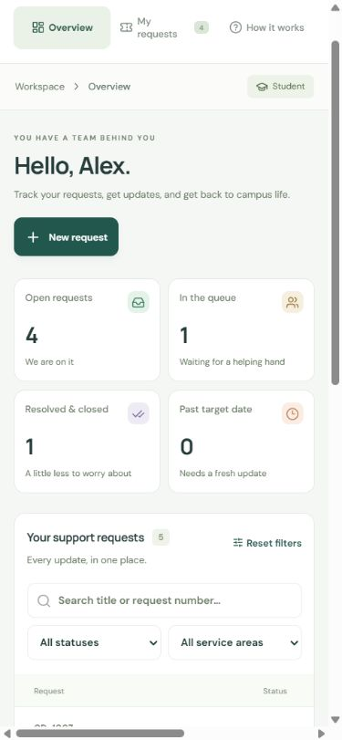

# CampusDesk

A campus support application for students and staff. Students submit and follow their own requests; staff use a shared service queue to triage, assign, reply, and resolve them. Public conversations and internal staff notes have different server-enforced visibility.

This is a portfolio demonstration with fictional people, campus requests, and planning targets. It is not affiliated with a university.

## Run locally

Requires **Node.js 24 or newer** and npm. The server uses Node's built-in SQLite module; there is no separate database service to install.

```sh
npm ci
cp .env.example .env
npm run dev
```

On Windows PowerShell, use `Copy-Item .env.example .env` for the copy step. Open **http://127.0.0.1:5173**. The API listens on **http://127.0.0.1:3001**; Vite proxies `/api` so cookies and requests use one browser origin. Keep `APP_ORIGIN` equal to the URL you open, including the hostname and port. Using `localhost` instead of `127.0.0.1` requires changing that value.

The development seed runs only when the database is empty. Restarting does not reset requests.

| Fictional role | Email | Demo password |
| --- | --- | --- |
| Student, Alex Morgan | `student@campus.example.test` | `CampusDemo!2026` |
| Staff, Sam Rivera | `staff@campus.example.test` | `CampusDemo!2026` |
| Staff, Jordan Lee | `jordan@campus.example.test` | `CampusDemo!2026` |
| Another student, Taylor Park | `other@campus.example.test` | `CampusDemo!2026` |

These public demo credentials are for an isolated demonstration. They are not real credentials. New registrations always create a student account.

## Try the workflow

1. Enter the student demo. Open an existing request or submit a new request with a service area, priority, and description. Search by title or `CD-` request number and filter by status or service area.
2. Sign out and enter the staff demo. Open the request, assign it to a staff member, and move it from **New → Triaged → In progress → Resolved → Closed**. Add a public reply and an internal note.
3. Return as the student. The public reply appears; the internal note and its count are excluded by the API. The other student account cannot open the request.
4. Open the same request in two staff browser sessions. Save changes in one, then save an old version in the other: the API rejects the stale update with `409`, and the interface offers refresh.

Staff can reopen a closed request to Triaged. A closed request cannot receive comments until reopened. Initial target dates are **2, 5, or 7 calendar days** for high, normal, or low priority. They are demo planning dates, not a service guarantee. Dates use UTC for consistent overdue calculations.

## Production build and start

```sh
npm run check
npm run build
npm start
```

For a local production smoke test, set `APP_ORIGIN=http://127.0.0.1:3001` in `.env` before `npm start`. The Express server serves the compiled React client and the API together. Change `PORT` and `APP_ORIGIN` together if a different port is used.

For a deployment handling real data, configure:

```dotenv
NODE_ENV=production
DEMO_SEED=0
HOST=0.0.0.0
PORT=3001
APP_ORIGIN=https://your-campusdesk.example
COOKIE_SECURE=1
DATABASE_PATH=/persistent-data/campusdesk.sqlite
```

Provide HTTPS through a trusted reverse proxy or hosting platform and attach persistent storage for SQLite. Run a **single application instance** for this version. A static-only host cannot run this Node API. Back up the SQLite database using a SQLite-aware backup operation while the app is running, or stop the app and copy the database and its WAL consistently. Do not commit the database or personal requests.

Build first, then provision the first staff account from the trusted server terminal:

```sh
npm run create-staff
```

The CLI asks for a name, email, and hidden password of at least 12 characters. For automated provisioning it also accepts `STAFF_NAME`, `STAFF_EMAIL`, and `STAFF_PASSWORD` from the environment. Use a secret manager for the password. It rejects an existing email and never promotes an existing student. Do not retain provisioning secrets in `.env` or commit them. Student signup can then be used normally.

## Architecture

```text
React + TypeScript client (Vite)
  └── same-origin /api requests and session cookie
      └── Express + Zod validation and authorization
          └── SQLite: users, sessions, limits, tickets, comments, events
```

- `src/`: authentication view, student/staff workspace, filters and pagination, ticket dialog, status controls, conversations, and guide.
- `shared/types.ts`: request categories, status labels/transitions, and API types shared by client and server.
- `server/app.ts`: routes, ownership/role checks, visibility, validation, transactions, session and CSRF handling.
- `server/database.ts`: schema, indexes, and an idempotent fictional development seed.
- `server/password.ts`: salted scrypt password hashing.
- `tests/api.test.ts`: HTTP behavioral tests against fresh isolated in-memory databases.

## Security and correctness

- The browser stores an opaque **HttpOnly, SameSite=Lax** session cookie. Only a SHA-256 digest of the session token is stored in SQLite. Sessions expire after 12 hours, logout revokes them, and each account is limited to 10 active sessions.
- Authenticated mutations require a 64-character hex CSRF token and trusted origin. Malformed Unicode tokens are rejected with `403`. Production cookies require the `COOKIE_SECURE=1` configuration above.
- Student ownership and staff role checks run on the server. Private notes are removed from student detail responses and list counts. Client controls are conveniences, not authorization boundaries.
- Zod validates strict request objects; prepared SQL statements handle data. User content is rendered as text by React, including multiline replies.
- Staff updates include a version number. An atomic version guard prevents stale edits from overwriting another update; ticket history is written in the same transaction.
- Signup, login, request creation, and replies are throttled. Failed account login attempts are bounded separately. Expired limiter records are cleared and the limiter table is capped. The app does not trust arbitrary proxy forwarding headers.
- Passwords, session cookies, request bodies, and private note contents are not intentionally logged. Application errors return a generic response.

## Validation

```sh
npm test
npm run build
```

The API tests cover student ownership, staff-only actions, internal note visibility/counts, transitions, invalid assignment/calendar dates, simultaneous stale versions, CSRF/origin rejection, logout, parallel duplicate signup, password storage, login/signup throttling, and bounded demo sessions. They do not require an external server or write a production database.

The native dialog supports keyboard focus and Escape. Inputs have labels and focus indicators. Small screens use a compact navigation bar and scroll the request table inside its own container. The client includes loading, empty, failed request, expired session, and stale edit feedback. See `HANDOFF.md` for the actual verification checkpoint and any remaining review work.

## Deliberate limits

This version has no email delivery, attachments, real-time events, SSO, password recovery, or staff administration screen. Demo roles represent a small campus team; all staff share the queue and can read internal notes. Read access alone does not notify staff. The data model uses `CREATE TABLE IF NOT EXISTS`; a future schema change needs a versioned migration. SQLite and in-process routing are intended for a small single-instance deployment; scale requirements would justify a separate database and shared limiter. Staff provisioning is a trusted CLI operation.

Google Fonts are an optional visual enhancement; system fonts are the fallback. There is no tracking script. Lucide icons are supplied by the installed open-source package. Application code is licensed under MIT; dependencies retain their own licenses.

## Explain it in an interview

Demonstrate one student request across both roles, then explain why private-note filtering belongs in the API. Show the stale version test, explain the SQL update guard and transaction, and describe the difference between session authentication, CSRF protection, and ownership authorization. Discuss the single-instance SQLite choice and which changes would be needed for multiple replicas. Describe only the features you have run and understood; this demo does not claim real campus users or service results.

## Screenshots

Captured from the compiled local application with fictional demo data.




